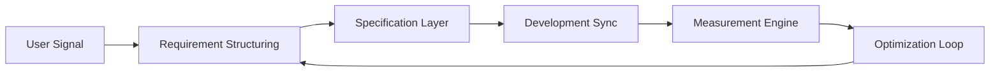

<p align="center">
  
</p>

<p align="center">
  
</p>

---

<p align="center">
  <a href="https://yakuphandevrez.com">
    
  </a>
  <a href="https://linkedin.com/in/yakuphandevrez/">
    
  </a>
  <a href="https://github.com/yakuphandevrez">
    
  </a>
  <a href="mailto:yakuphandevrez@gmail.com">
    
  </a>
</p>

---

## ▣ SYSTEM PROFILE

```text
ROLE        : Product-Focused Computer Engineer
DOMAIN      : B2B SaaS / Digital Platforms
MODE        : Structured Execution
SIGNATURE   : Ship → Measure → Optimize
```

---

## ▣ OPERATING MATRIX

<p align="center">


</p>

---

## ▣ EXECUTION FLOW



---

## ▣ CORE ARCHITECTURE

<table>
<tr>
<td width="33%" align="center">

### PRODUCT
Requirement Engineering  
Roadmap Modeling  
Business Rule Definition  
Acceptance Criteria  

</td>

<td width="33%" align="center">

### DATA
SQL Analysis  
KPI Monitoring  
Performance Tracking  
Insight Extraction  

</td>

<td width="33%" align="center">

### EXECUTION
Sprint Planning  
Backlog Governance  
UAT Validation  
Cross-Team Sync  

</td>
</tr>
</table>

---

## ▣ DEV SIGNAL

<p align="center">
  
</p>

<p align="center">
  
</p>

---

## ▣ SYSTEM PRINCIPLES

<p align="center">


</p>

---

## ▣ LONG TERM SYSTEM GOAL

Build structured, measurable, scalable technology systems  
designed for long-term strategic impact.

"Ancora Imparo"
